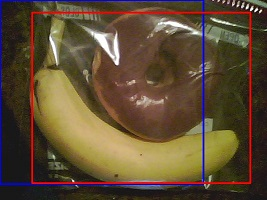

# BBAM: Bounding Box Attribution Map for Weakly Supervised Semantic and Instance Segmentation

The implementation of BBAM: Bounding Box Attribution Map for Weakly Supervised Semantic and Instance Segmentation, Jihun Yi, Chaehun Shin, and Sungroh Yoon, CVPR 2021. [[paper](https://arxiv.org/abs/2103.08907)]


Input image and predicted box for 'banana' (red box)            |  BBAM over iterations
:-------------------------:|:-------------------------:
  |  


# Installation

We kindly refer to [INSTALLATION](https://github.com/facebookresearch/maskrcnn-benchmark/blob/master/INSTALL.md) from [maskrcnn-benchmark](https://github.com/facebookresearch/maskrcnn-benchmark).

- In our case, the build is successful only when the CUDA version of the system matches the version of the cuda-toolkit of the conda environment.
- When you encounter a 'gcc' failed error, [this](https://github.com/facebookresearch/maskrcnn-benchmark/issues/1257) can help.
- This repository is tested on Ubuntu 18.04, with Python 3.6, PyTorch 1.4, pydensecrf, scipy, imageio, and opencv-python, joblib, and scikit-image.
# Examples

#### Step 1. Prepare Dataset

- Download PASCAL VOC 2012 benchmark: [Download](https://drive.google.com/file/d/1e-yprFZzOYDAehjyMVyC5en5mNq6Mjh4/view?usp=sharing)

#### Step 2. Prepare pre-trained object detector

- Pre-trained model used in this paper: [Download](https://drive.google.com/file/d/1O6YTWq4uUnGLC-b7wKNX5tWiF2lJjZBw/view?usp=sharing)
- You can also train your own object detectors following [maskrcnn-benchmark](https://github.com/facebookresearch/maskrcnn-benchmark)

#### Step 3. Obtain BBAMs for PASCAL VOC validation images

```bash
python tools/BBAM/BBAM_FRCNN.py --gpu 0 --img_idx 30 --visualize True
```

`img_idx` denotes image index of PASCAL VOC validation images to be explained, ranging from 0 to 1448 (inclusive).

#### Step 4. Obtain pseudo ground-truth masks for PASCAL VOC training images

- Obtain BBAMs for training images
```bash
python tools/BBAM/BBAM_training_images_multi.py
```

- Create COCO style annotation files for training Mask R-CNN
```bash
python tools/BBAM/make_annotation/make_cocoann_topCRF_parallel.py
```

- (Optional) Refine pseudo ground-truth masks with pre-computed MCG proposals. You can download pre-computed MCG proposals at [here](https://www2.eecs.berkeley.edu/Research/Projects/CS/vision/grouping/mcg/)
```bash
python tools/BBAM/make_annotation/BBAM_plus_mcg.py
```


- Create semantic segmentation annotations for training DeepLab-v2
```bash
python tools/BBAM/make_annotation/create_semantic_labels.py
```


#### Step 5. Train an instance segmentation network.
- Edit [maskrcnn_benchmark/config/paths_catalog.py](maskrcnn_benchmark/config/paths_catalog.py), similar to 'voc_2012_train_aug_cocostyle_BBAM_fg_85_ignore_2_mcg'.
- Edit DATASETS.TRAIN in [configs/pascal_voc/BBAM_VOC_aug_FPN_R101_MaskRCNN.yaml](configs/pascal_voc/BBAM_VOC_aug_FPN_R101_MaskRCNN.yaml).
- Multi-GPU training
```bash
CUDA_VISIBLE_DEVICES=0,1,2,3 python -m torch.distributed.launch --nproc_per_node=4 tools/train_net.py --config-file configs/pascal_voc/BBAM_VOC_aug_FPN_R101_MaskRCNN.yaml
```
- Evaluation
```bash
CUDA_VISIBLE_DEVICES=0 python tools/test_net.py --config-file "configs/pascal_voc/BBAM_VOC_aug_FPN_R101_MaskRCNN.yaml" --ckpt BBAM_Mask_RCNN_logs_mcg85/model_final.pth TEST.IMS_PER_BATCH 1
```
- (Optional) Evaluation with CRFs 
```bash
python tools/BBAM/CRF_for_prediction.py
```

#### Step 6. Train a semantic segmentation network.
- To train DeepLab-v2, we refer to [deeplab-pytorch](https://github.com/kazuto1011/deeplab-pytorch). However, this repo contains only COCO pre-trained model. We provide [ImageNet pre-trained model](https://drive.google.com/file/d/1O6YTWq4uUnGLC-b7wKNX5tWiF2lJjZBw/view?usp=sharing) for a fair comparison with the other methods.


# Reference

- [maskrcnn-benchmark](https://github.com/facebookresearch/maskrcnn-benchmark)


- [deeplab-pytorch](https://github.com/kazuto1011/deeplab-pytorch)
